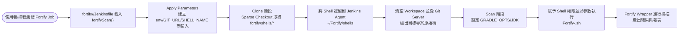

# Jenkins Shared Library（Fortify 掃描）

## 專案概觀
```
專案根目錄
├─ fortify/
│  ├─ Jenkinsfile .............. 總管流程，依參數觸發各個 Fortify 子 Job (FORTIFY-ALL-SCAN-FLOW)
│  ├─ Jenkinsfile-release ...... 總管發佈流程，依參數觸發各個 Publish/Release 子 Job (FORTIFY-RELEASE-FSAP-FLOW-UTILS)
│  ├─ <project>/Jenkinsfile .... 指定 Git 儲存庫與 shell，實際邏輯交給共有函式 (FORTIFY-<專案名稱>)
│  └─ shells/*.sh .............. Fortify wrapper scripts，掃描前會複製到 Jenkins 主機
├─ vars/
│  └─ fortifyScan.groovy ...... Pipeline 共用函式，內含 Apply Parameters、Clone、Scan 階段
└─ README.md .................. 使用說明與檔案對照
```

## Jenkinsfile 一覽
| Jenkinsfile | Git 儲存庫 | Shell Script | 功能摘要 |
| --- | --- | --- | --- |
| `fortify/Jenkinsfile` | 依使用者選項觸發各產品 Job | － | 產生參數並呼叫下游 Job（FSAP-ADM/RUNTIME/GATEWAY/MODEL/BPMN-UTILS、TXCONTROL、NCL、NCL-BATCH、FAC、NCB）。|
| `fortify/Jenkinsfile-release` | 發佈共用函式庫到maven倉庫 | － | 產生參數並呼叫下游 Job（FORTIFY-RELEASE-*）。|
| `fortify/fsap-adm/Jenkinsfile` | `ssh://git@bt-gitea:22/BOT/fsap-adm.git` | `Fortify-FSAP-ADM.sh` | FSAP-ADM Gradle 子專案掃描。|
| `fortify/fsap-runtime/Jenkinsfile` | `ssh://git@bt-gitea:22/BOT/fsap-runtime.git` | `Fortify-FSAP-RUNTIME.sh` | FSAP-RUNTIME 服務掃描。|
| `fortify/fsap-gateway/Jenkinsfile` | `ssh://git@bt-gitea:22/BOT/fsap-gateway.git` | `Fortify-FSAP-GATEWAY.sh` | FSAP-GATEWAY API 掃描。|
| `fortify/fsap-model/Jenkinsfile` | `ssh://git@bt-gitea:22/BOT/fsap-model.git` | `Fortify-FSAP-MODEL.sh` | FSAP-MODEL 元件掃描。|
| `fortify/fsap-bpmn-utils/Jenkinsfile` | `ssh://git@bt-gitea:22/BOT/bpmn-utils.git` | `Fortify-FSAP-BPMN-UTILS.sh` | BPMN 工具套件掃描。|
| `fortify/tx-control/Jenkinsfile` | `ssh://git@bt-gitea:22/BOT/tx-control.git` | `Fortify-TXCONTROL.sh` | TXCONTROL 掃描。|
| `fortify/fac/Jenkinsfile` | `ssh://git@bt-gitea:22/BOT/fac.git` | `Fortify-FAC.sh` | FAC 專案掃描。|
| `fortify/ncb/Jenkinsfile` | `ssh://git@bt-gitea:22/BOT/ncb.git` | `Fortify-NCB.sh` | NCB 專案掃描。|
| `fortify/ncl/Jenkinsfile` | `ssh://git@bt-gitea:22/BOT/ncl.git` | `Fortify-NCL.sh` | NCL 專案掃描。|
| `fortify/ncl-batch/Jenkinsfile` | `ssh://git@bt-gitea:22/BOT/ncl-batch.git` | `Fortify-NCL-BATCH.sh` | NCL 批次版本掃描。|

## `vars/fortifyScan.groovy`
- 透過 `@Library('fortifyScan') _` 載入，所有子 Jenkinsfile 只需傳入 `gitUrl` 與 `shellName`。
- 主要階段：
  1. **Apply Parameters**：若 Job 直接在 Jenkins UI 觸發就沿用現有參數，否則建立 `env`, `GIT_URL`, `SHELL_NAME`, `JENKINS_JDK_TOOL` 等輸入。
  2. **Clone**：
     - 清空 Workspace。
     - 從 `jenkins-shared-library` 進行 Sparse Checkout，只取 `fortify/shells`，並複製到 `~/Fortify/shells`。
     - 重新清空 Workspace 並檢出目標專案（依 `env` 分支；憑證使用 `gitea`）。
  3. **Scan**：調整 shell 權限後執行 `Fortify` wrapper。
- 需要預先在 Jenkins Global Tool Configuration 註冊可用的 JDK 名稱供 `JENKINS_JDK_TOOL` 參數下拉選擇。

## 流程圖：Git Shell 取得與掃描執行


## fortify/shells
- 每個 shell 代表一個 Fortify 掃描腳本，必須存在於 repository 中並會被複製到 Jenkins Agent 的 `~/Fortify/shells`。
- 檔名需與 Jenkinsfile 內的 `shellName` 值一致。

## 使用方式
1. **註冊 Shared Library**：在 Jenkins Global Pipeline Libraries 新增一筆名稱 `fortifyScan`，指向此 Git 儲存庫的主要分支。
2. **建立子專案 Job**：
   - 於 Jenkins 新增 Pipeline Job，並將 `Jenkinsfile` 指向對應的 `fortify/<project>/Jenkinsfile`。
   - 這些 Job 不需額外 stage，僅透過 `fortifyScan` 實作 Clone 與 Scan。
3. **建立總管 Job**：
   - 另建一個 Pipeline Job 使用 `fortify/Jenkinsfile`。
   - 在建置時選擇 `env`（`sit` 或 `uat`）與需要掃描的布林參數，即可逐一觸發對應子 Job。
4. **準備憑證與工具**：
   - 確認 Jenkins Credential `gitea` 可以存取所有 Git 儲存庫。
   - Jenkins Agent 需能夠執行 `sudo chown/chmod` 並安裝 Fortify、Gradle 相關依賴。
5. **執行掃描**：
   - 從總管 Job 點選 Build 或排程觸發，Pipeline 會根據參數自動複製 shell、檢出專案並執行 Fortify script。
   - 若需單獨跑某一專案，可直接觸發對應子 Job，並在 `Build with Parameters` 中指定 `env`, `GIT_URL`, `SHELL_NAME`, `JENKINS_JDK_TOOL`。

以上內容提供每個檔案的作用與部署步驟，可依據實際需求調整參數與 shell 內容。
