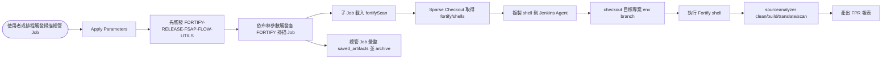

# Jenkins Shared Library（Fortify 掃描）

## 專案概觀

此 repository 維護 Jenkins Fortify 掃描流程使用的 Shared Library、總管 Pipeline、子專案 Pipeline 與 Fortify shell。

```text
專案根目錄
├─ fortify/
│  ├─ Jenkinsfile .............. Fortify 掃描總管流程，依參數觸發各產品掃描 Job
│  ├─ Jenkinsfile-release ...... 掃描前 release/publishToMavenLocal 總管流程
│  ├─ <project>/Jenkinsfile .... 子專案掃描流程，指定 Git 儲存庫與 shell
│  └─ shells/*.sh .............. Fortify wrapper scripts，掃描前會複製到 Jenkins 主機
├─ vars/
│  └─ fortifyScan.groovy ....... Pipeline 共用函式，內含 Apply Parameters、Clone、Scan 階段
└─ README.md ................... 使用說明與檔案對照
```

## Pipeline 一覽

| Jenkinsfile | Jenkins Job | Git 儲存庫 | Shell Script | 功能摘要 |
| --- | --- | --- | --- | --- |
| `fortify/Jenkinsfile` | 掃描總管 Job | 依參數觸發下游 Job | - | 建立掃描參數、先觸發 `FORTIFY-RELEASE-FSAP-FLOW-UTILS`，再依勾選項目呼叫各 `FORTIFY-*` 掃描 Job，最後歸檔指定 artifacts。 |
| `fortify/Jenkinsfile-release` | Release 總管 Job | 依序觸發 release 下游 Job | - | 觸發多個 `FORTIFY-RELEASE-*` Job，主要用於掃描前將共用模組 publish 到 Maven local。 |
| `fortify/fsap-adm/Jenkinsfile` | `FORTIFY-FSAP-ADM` | `ssh://git@bt-gitea:22/BOT/fsap-adm.git` | `Fortify-FSAP-ADM.sh` | 掃描 FSAP-ADM 多個 Gradle 子模組。 |
| `fortify/fsap-runtime/Jenkinsfile` | `FORTIFY-FSAP-RUNTIME` | `ssh://git@bt-gitea:22/BOT/fsap-runtime.git` | `Fortify-FSAP-RUNTIME.sh` | 掃描 FSAP-RUNTIME 的 `boot:runtime`。 |
| `fortify/fsap-gateway/Jenkinsfile` | `FORTIFY-FSAP-GATEWAY` | `ssh://git@bt-gitea:22/BOT/fsap-gateway.git` | `Fortify-FSAP-GATEWAY.sh` | 掃描 FSAP-GATEWAY 的 `boot:fastgateway`。 |
| `fortify/fsap-model/Jenkinsfile` | `FORTIFY-FSAP-MODEL` | `ssh://git@bt-gitea:22/BOT/fsap-model.git` | `Fortify-FSAP-MODEL.sh` | 掃描 FSAP-MODEL 的 `model-grpc-common`。 |
| `fortify/fsap-bpmn-utils/Jenkinsfile` | `FORTIFY-FSAP-BPMN-UTILS` | `ssh://git@bt-gitea:22/BOT/bpmn-utils.git` | `Fortify-FSAP-BPMN-UTILS.sh` | 掃描 BPMN 工具套件的 `bpmn-utils`。 |
| `fortify/tx-control/Jenkinsfile` | `FORTIFY-TXCONTROL` | `ssh://git@bt-gitea:22/BOT/tx-control.git` | `Fortify-TXCONTROL.sh` | 掃描 TXCONTROL 專案。 |
| `fortify/fac/Jenkinsfile` | `FORTIFY-FAC` | `ssh://git@bt-gitea:22/BOT/fac.git` | `Fortify-FAC.sh` | 掃描 FAC 專案。 |
| `fortify/ncb/Jenkinsfile` | `FORTIFY-NCB` | `ssh://git@bt-gitea:22/BOT/ncb.git` | `Fortify-NCB.sh` | 掃描 NCB 專案。 |
| `fortify/ncl/Jenkinsfile` | `FORTIFY-NCL` | `ssh://git@bt-gitea:22/BOT/ncl.git` | `Fortify-NCL.sh` | 掃描 NCL 專案。 |
| `fortify/ncl-batch/Jenkinsfile` | `FORTIFY-NCL-BATCH` | `ssh://git@bt-gitea:22/BOT/ncl-batch.git` | `Fortify-NCL-BATCH.sh` | 掃描 NCL 批次專案。 |

## 掃描總管：`fortify/Jenkinsfile`

總管 Job 使用 `agent any`，並套用：

- `timestamps()`
- `ansiColor('xterm')`
- `timeout(time: 6, unit: 'HOURS')`

第一次執行時會建立下列參數，之後需使用 `Build with Parameters` 觸發實際流程。

| 參數 | 類型 | 說明 |
| --- | --- | --- |
| `env` | choice | 掃描環境，選項為 `sit`、`uat`；也會作為目標 Git branch 名稱傳給子 Job。 |
| `is_scan_fsap_adm` | boolean | 是否觸發 `FORTIFY-FSAP-ADM`。 |
| `is_scan_fsap_runtime` | boolean | 是否觸發 `FORTIFY-FSAP-RUNTIME`。 |
| `is_scan_fsap_gateway` | boolean | 是否觸發 `FORTIFY-FSAP-GATEWAY`。 |
| `is_scan_fsap_model` | boolean | 是否觸發 `FORTIFY-FSAP-MODEL`。 |
| `is_scan_fsap_bpmn_utils` | boolean | 是否觸發 `FORTIFY-FSAP-BPMN-UTILS`。 |
| `is_scan_txcontrol` | boolean | 是否觸發 `FORTIFY-TXCONTROL`。 |
| `is_scan_ncl` | boolean | 是否觸發 `FORTIFY-NCL`。 |
| `is_scan_ncl_batch` | boolean | 是否觸發 `FORTIFY-NCL-BATCH`。 |
| `is_scan_fac` | boolean | 是否觸發 `FORTIFY-FAC`。 |
| `is_scan_ncb` | boolean | 是否觸發 `FORTIFY-NCB`。 |

執行順序：

1. `RELEASE-UTILS`：每次有參數觸發時都會先呼叫 `FORTIFY-RELEASE-FSAP-FLOW-UTILS`。
2. 依參數勾選狀態依序觸發：`FSAP-MODEL`、`FSAP-BPMN-UTILS`、`FSAP-RUNTIME`、`FSAP-ADM`、`FSAP-GATEWAY`、`TXCONTROL`、`NCL`、`NCL-BATCH`、`FAC`、`NCB`。
3. `artifacts`：清空並重建 `saved_artifacts/`，從 `../FORTIFY-*/` 搜尋指定檔名後複製進來，最後以 `archiveArtifacts` 歸檔。

各產品 stage 使用 `catchError(buildResult: 'SUCCESS', stageResult: 'FAILURE')`，因此單一產品失敗時總管流程仍會繼續跑後續 stage，但該 stage 會標示為失敗。

歸檔清單：

```text
bot-fac-app.war
bot-fac-batch-app.war
bot-ncl-app.war
bot-ncl-batch-app.war
fsap-admin.jar
fsap-batch.jar
fsap-common-service.jar
fsap-gateway.jar
fsap-log-agent-server.jar
fsap-runtime.jar
fsap-schedule.jar
fsap-service-monitor.jar
ncb-server.jar
```

## Release 總管：`fortify/Jenkinsfile-release`

Release 總管 Job 使用 `timeout(time: 1, unit: 'HOURS')`，第一次執行時會建立：

| 參數 | 類型 | 說明 |
| --- | --- | --- |
| `env` | choice | 發佈環境，選項為 `sit`、`uat`。 |
| `is_offline` | boolean | 是否以離線包版方式執行，預設為 `true`。 |

有參數觸發後會依序呼叫下列下游 Job：

| Stage | 下游 Job |
| --- | --- |
| `BPMN-UTILS` | `FORTIFY-RELEASE-FSAP-BPMN-UTILS` |
| `MODEL` | `FORTIFY-RELEASE-FSAP-MODEL` |
| `LOG-AGENT-COMMON` | `FORTIFY-RELEASE-FSAP-LOG-AGENT-COMMON` |
| `MONITOR-PLUGIN` | `FORTIFY-RELEASE-FSAP-MONITOR-PLUGIN` |
| `LOG-AGENT-CLIENT` | `FORTIFY-RELEASE-FSAP-LOG-AGENT-CLIENT` |
| `DISPATCHER-CLIENT` | `FORTIFY-RELEASE-FSAP-DISPATCHER-CLIENT` |
| `COMMAND-UTILS` | `FORTIFY-RELEASE-FSAP-COMMAND-UTILS` |
| `RUNTIME` | `FORTIFY-RELEASE-FSAP-RUNTIME` |
| `TX-CONTROL` | `FORTIFY-RELEASE-TX-CONTROL` |
| `NCL` | `FORTIFY-RELEASE-NCL` |

多數下游 Job 會帶入固定參數：

- `is_assemble=true`
- `is_test_report=false`
- `is_code_analysis=false`
- `is_owasp_analysis=false`
- `is_sonar_analysis=false`
- `is_put_files=false`
- `is_remote_start=false`
- `is_offline=params.is_offline`
- `only_publishToMavenLocal=true`

`RUNTIME` stage 目前沒有傳入 `only_publishToMavenLocal`。

## 共用函式：`vars/fortifyScan.groovy`

所有子專案掃描 Jenkinsfile 都透過 shared library 載入共用函式：

```groovy
@Library('fortifyScan') _
fortifyScan(
    gitUrl: 'ssh://git@bt-gitea:22/BOT/<project>.git',
    shellName: 'Fortify-<PROJECT>.sh'
)
```

主要 stage：

1. **Apply Parameters**
   - 若 Jenkins 已帶入任何參數，設定 `env.is_param_from_UI = 'true'`。
   - 若沒有參數，設定 `env.is_param_from_UI = 'false'`，並建立 `env`、`GIT_URL`、`SHELL_NAME`、`JENKINS_JDK_TOOL` 參數。
   - `JENKINS_JDK_TOOL` 會讀取 Jenkins Global Tool Configuration 中已註冊的 JDK；未指定時使用第一組 JDK。

2. **Clone**
   - `cleanWs()` 清空 workspace。
   - 從 `ssh://git@bt-gitea:22/BOT/jenkins-shared-library.git` 的 `main` branch 進行 Sparse Checkout，只取 `fortify/shells`。
   - 將 `fortify/shells/*.sh` 複製到 `~/Fortify/shells/`。
   - 再次 `cleanWs()`。
   - 使用 Jenkins credential `gitea` checkout `params.GIT_URL`，branch 為 `params.env`。

3. **Scan**
   - Fortify shell 路徑固定為 `/var/jenkins_home/Fortify/shells/${params.SHELL_NAME}`。
   - 執行 `sudo chown 1111:1111` 與 `sudo chmod +x` 設定 shell 權限。
   - 執行 `sudo chmod +x gradlew`。
   - 執行 `${fortifyScript} ${params.env}`，將 `sit` 或 `uat` 傳入 shell 第一個參數。

## Fortify Shell 一覽

所有 shell 都會接收第一個參數作為 `ENV`，並輸出 FPR 到：

```text
/var/jenkins_home/Fortify/reports/<BUILDID>/<ENV>/<yyyyMMdd_HHmmss>/<name>.fpr
```

Shell 內固定加入 Fortify 25.4.0 工具路徑：

```text
/var/jenkins_home/Fortify/OpenText_SAST_Fortify_25.4.0/bin
/var/jenkins_home/Fortify/OpenText_Application_Security_Tools_25.4.0/bin
```

| Shell | BUILDID | 預期 workspace | Gradle build 指令摘要 |
| --- | --- | --- | --- |
| `Fortify-FSAP-ADM.sh` | `FSAP-ADMIN` | `/var/jenkins_home/workspace/FORTIFY-FSAP-ADM` | 依序 build `fsap-admin-api`、`fsap-batch`、`fsap-common-service`、`log-agent:fsap-log-agent-server`、`fsap-schedule`、`fsap-monitor:fsap-service-monitor`，皆加上 `-x check --offline`。 |
| `Fortify-FSAP-RUNTIME.sh` | `FSAP-RUNTIME` | `/var/jenkins_home/workspace/BOT-FORTIFY-FSAP-RUNTIME` | `boot:runtime:clean boot:runtime:build -x publishToMavenLocal -x check --offline`。 |
| `Fortify-FSAP-GATEWAY.sh` | `FSAP-GATEWAY` | `/var/jenkins_home/workspace/FORTIFY-FSAP-GATEWAY` | `boot:fastgateway:clean boot:fastgateway:build -x check --offline`。 |
| `Fortify-FSAP-MODEL.sh` | `FSAP-MODEL` | `/var/jenkins_home/workspace/FORTIFY-FSAP-MODEL` | `model-grpc-common:clean model-grpc-common:build -x publishToMavenLocal -x check --offline`。 |
| `Fortify-FSAP-BPMN-UTILS.sh` | `FSAP-BPMN-UTILS` | `/var/jenkins_home/workspace/BOT-FORTIFY-FSAP-BPMN-UTILS` | `bpmn-utils:clean bpmn-utils:build -x publishToMavenLocal -x check --offline`。 |
| `Fortify-TXCONTROL.sh` | `TXCONTROL` | `/var/jenkins_home/workspace/FORTIFY-TXCONTROL` | `clean build -x publishToMavenLocal -x check --offline`。 |
| `Fortify-FAC.sh` | `FAC` | `/var/jenkins_home/workspace/FORTIFY-FAC` | `clean build -x check --offline`。 |
| `Fortify-NCB.sh` | `NCB` | `/var/jenkins_home/workspace/FORTIFY-NCB` | `clean build -x check --offline`。 |
| `Fortify-NCL.sh` | `NCL` | `/var/jenkins_home/workspace/FORTIFY-NCL` | `clean build -x check --offline`。 |
| `Fortify-NCL-BATCH.sh` | `NCL-BATCH` | `/var/jenkins_home/workspace/FORTIFY-NCL-BATCH` | `clean build -x check --offline`。 |

## 流程圖



## Jenkins 環境需求

- Jenkins Global Pipeline Libraries 需註冊 shared library 名稱 `fortifyScan`，並指向此 repository。
- Jenkins credential `gitea` 需可讀取此 repository 與所有目標專案 repository。
- Jenkins Global Tool Configuration 需至少註冊一組 JDK，供 `JENKINS_JDK_TOOL` 使用。
- Jenkins Agent 需安裝 Fortify SCA 與 Application Security Tools 25.4.0，且路徑需符合 shell 內設定。
- Jenkins Agent 需可執行 `sudo chown`、`sudo chmod`，以調整 `/var/jenkins_home/Fortify/shells/*.sh` 與 `gradlew` 權限。
- Jenkins Agent 需具備 Pipeline 中使用的 step/plugin，例如 `cleanWs`、`timestamps`、`ansiColor`、`archiveArtifacts`。
- 各目標專案需存在與 `env` 參數同名的 branch，例如 `sit` 或 `uat`。
- Shell 內的 `PROJECTROOT0` 是固定 workspace 路徑，Jenkins Job 名稱或 workspace 設定需與該路徑一致。
- Shell 使用 Gradle `--offline`，因此 Jenkins Maven/Gradle cache 需事先備妥依賴。

## 使用方式

1. 在 Jenkins Global Pipeline Libraries 新增名稱為 `fortifyScan` 的 shared library。
2. 建立各產品掃描 Pipeline Job，Jenkinsfile 指向對應的 `fortify/<project>/Jenkinsfile`。
3. 建立 release 總管 Job，Jenkinsfile 指向 `fortify/Jenkinsfile-release`。
4. 建立掃描總管 Job，Jenkinsfile 指向 `fortify/Jenkinsfile`。
5. 第一次執行總管或子專案 Job 時，Pipeline 會建立參數；重新進入 `Build with Parameters` 後才會執行實際流程。
6. 從掃描總管 Job 選擇 `env` 與要掃描的產品，Pipeline 會先跑 release utils，再依序觸發掃描 Job。
7. 若需單獨掃描某一產品，可直接觸發對應子 Job，並確認 `env`、`GIT_URL`、`SHELL_NAME`、`JENKINS_JDK_TOOL` 參數正確。

## 新增或調整掃描專案

新增掃描專案時需同步調整：

1. 新增 `fortify/<project>/Jenkinsfile`，透過 `fortifyScan(gitUrl: ..., shellName: ...)` 指定目標 repo 與 shell。
2. 將對應 Fortify shell 放到 `fortify/shells/`，檔名需與 `shellName` 完全一致。
3. 確認 shell 內的 `BUILDID`、`FPR`、`PROJECTROOT0` 與 Gradle build 指令符合 Jenkins Job 與目標專案。
4. 若需由掃描總管觸發，在 `fortify/Jenkinsfile` 加入 boolean 參數與 stage。
5. 若掃描前需 publish 共用模組，在 `fortify/Jenkinsfile-release` 加入對應 release stage。
6. 若產物需由總管歸檔，在 `filesToCopy` 清單加入檔名。
